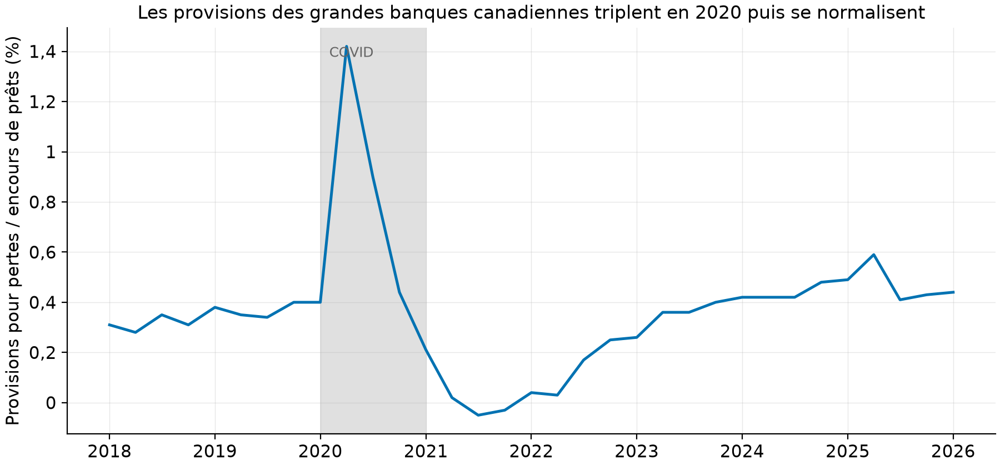
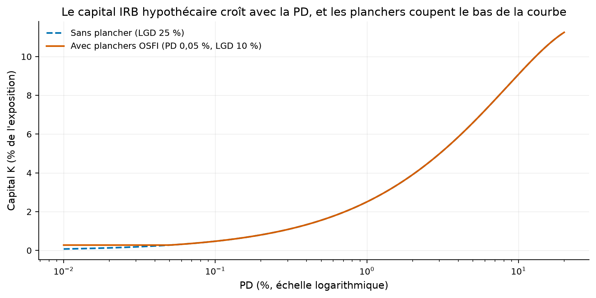
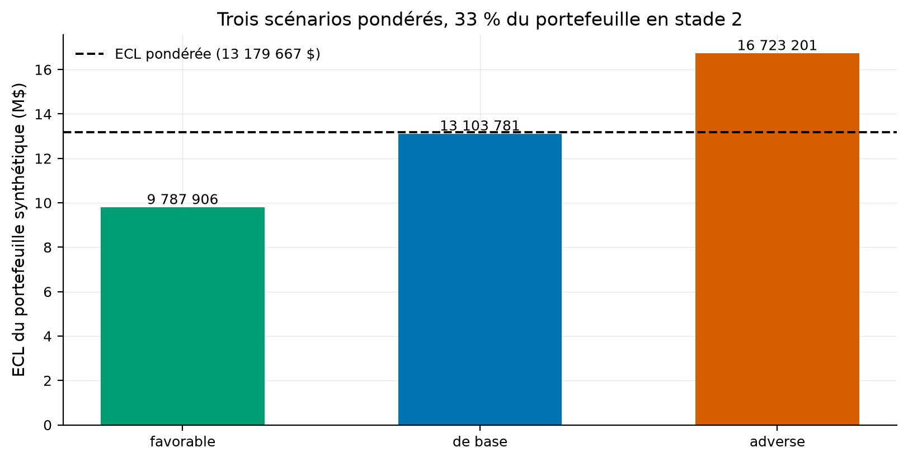
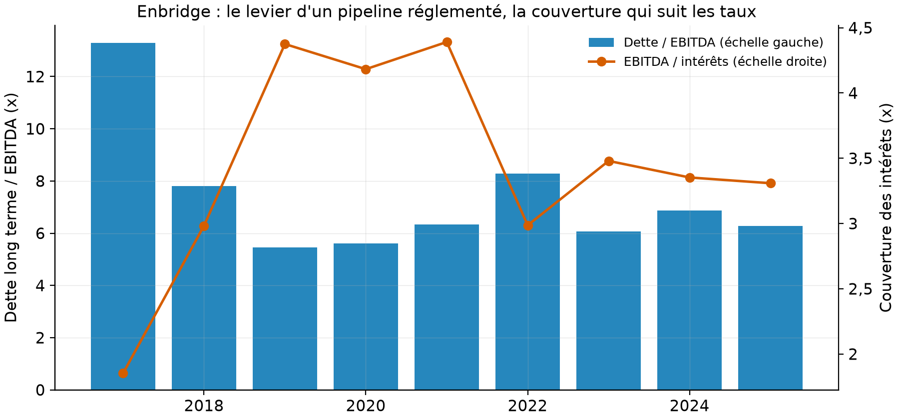

# Un laboratoire de crédit : des moteurs de PD vérifiés sur vérité connue, jusqu'au dossier Excel

Le risque de crédit de bout en bout : trois moteurs de probabilité de défaut testés sur un
portefeuille synthétique dont les paramètres sont CONNUS (un moteur honnête doit les retrouver, et
c'est testé), la provision IFRS 9 par scénarios pondérés, le capital réglementaire aux paramètres
de l'OSFI, les provisions réelles des grandes banques canadiennes, et le livrable que dix offres
d'emploi sur dix demandent : un dossier de crédit Excel complet sur Enbridge.

[](https://github.com/Guilou001/10-credit-bancaire/actions/workflows/ci.yml)


Le même contenu en PDF : [rapport/rapport.pdf](rapport/rapport.pdf).

**Résultat en une phrase.** Sur 8 000 prêts simulés (381 686 lignes prêt-mois), **le modèle de
hasard en temps discret retrouve les trois paramètres du générateur** (−6,13 estimé contre −6,20
vrai pour la constante, −1,05 contre −1,10 pour le score, 0,85 contre 0,90 pour le cycle) ; l'ECL
pondérée par trois scénarios dépasse celle du scénario central (13,18 contre 13,10 M$, la
convexité mesurée), et le dossier Enbridge illustre pourquoi une grille de ratios donne B là où
les agences donnent BBB : elle ne voit pas la nature contractuelle des flux.

*English summary.* Credit risk end to end, with a verification twist: three PD engines (WoE
scorecard, Shumway discrete-time hazard, Vasicek point-in-time) tested on a synthetic loan-month
panel with KNOWN parameters that the hazard model provably recovers; IFRS 9 ECL with weighted
scenarios and staging (weighted ECL exceeds the central scenario, convexity measured); OSFI-floored
IRB mortgage capital verified against a hand computation; real Canadian big-six loan-loss
provisions (Bank of Canada Valet, peak 1.42 % in 2020Q2, negative in 2021); and the deliverable
every commercial-credit posting asks for: a full Excel credit file on Enbridge (spreading, ratios,
live-formula projections, weighted scorecard, covenants) with a bilingual memo explaining why a
generic rubric yields internal B where agencies assign BBB. Freddie Mac loan-level data requires
registration and is declared as a manual deposit, not silently skipped.

## 1. La question posée

Un modèle de crédit peut avoir de bons indicateurs et être faux : comment PROUVER qu'un moteur de
PD mesure ce qu'il prétend ? La réponse du dépôt : le faire tourner sur un monde où la vérité est
connue. Un portefeuille synthétique est généré par un modèle de hasard dont on fixe les paramètres,
puis chaque moteur est jugé sur sa capacité à les retrouver. En mots simples : avant de croire un
modèle sur des données réelles, on vérifie qu'il retrouve la recette d'un monde qu'on a fabriqué.
Ensuite viennent les trois usages bancaires : provisionner (IFRS 9), capitaliser (Bâle/OSFI), et
décider d'un crédit (le dossier Enbridge).

## 2. D'où vient le projet, et ce qu'il apporte

Les briques sont canoniques : la carte de score à poids de la preuve (le standard bancaire), le
hasard en temps discret de Shumway (2001), le modèle à un facteur de Vasicek (2002) qui fonde à la
fois le passage au point du cycle et la formule de capital de Bâle (BCBS, 2005), l'ECL d'IFRS 9
(BCBS d350, 2015), et les planchers du chapitre 5 de la ligne directrice sur les normes de fonds
propres de l'OSFI (corrélation hypothécaire 0,15, PD plancher 0,05 %, LGD plancher 10 %,
rapportés). Ce que ce dépôt apporte :

- **La vérification par vérité connue** : le simulateur (défaut ET remboursement anticipé en
  risque concurrent) est publié avec ses paramètres, et le test exige que le moteur les retrouve.
- **La convexité rendue visible** : l'ECL pondérée par scénarios dépasse l'ECL du scénario
  central, sur les mêmes prêts, par la convexité de la PD dans le cycle et l'asymétrie déclarée
  des scénarios ; c'est l'argument central d'IFRS 9 et il est mesuré, pas affirmé.
- **Le miroir réel** : les provisions des grandes banques canadiennes (Valet, série
  FVI_PCL_RATIO_SIB) donnent l'échelle du vrai cycle du crédit, pic à 1,42 % au T2 2020 et
  reprises NÉGATIVES en 2021.
- **Le volet obligatoire du métier** : le dossier de crédit Excel (étalement, ratios, projection à
  formules vivantes, grille de cotation, covenants) sur une vraie société du TSX.

## 3. Les données

| Source | Contenu | Statut et accès |
|---|---|---|
| Simulateur du dépôt | 8 000 prêts, 72 mois, hasard logistique (constante −6,2 ; score −1,1 ; cycle 0,9), remboursement anticipé 0,8 %/mois | vérité connue, graine fixée |
| SEC, companyfacts (CIK 895728) | Enbridge, exercices 2011-2025 en CAD (revenus, EBITDA, dette, intérêts, flux ; la source remonte à 2010, l'exercice incomplet est écarté, coupe déclarée) | mesuré ; `clab fetch`, jamais commité |
| Banque du Canada, Valet | FVI_PCL_RATIO_SIB : provisions pour pertes / encours, grandes banques, 2018-2026 trimestriel | mesuré (rapporté par la BdC) ; `clab fetch` |
| Freddie Mac, échantillon prêt par prêt | 50 000 prêts par millésime, 1999-2026 | inscription gratuite non scriptable : DÉPÔT MANUEL déclaré, le laboratoire tourne sans lui sur le synthétique |

## 4. La méthode, pas à pas

1. **Simuler la vérité** : chaque mois, chaque prêt vivant fait défaut avec un hasard logistique
   (fonction de son score à l'octroi et du cycle), ou rembourse par anticipation (risque
   concurrent qui censure la trajectoire, le piège classique des données de prêts).
2. **Trois moteurs de PD.** La carte de score : le score est découpé en classes, chaque classe
   reçoit son poids de la preuve (WoE, le logarithme du rapport bons/mauvais de la classe relatif
   au portefeuille), une logistique prédit le défaut à 12 mois. Le hasard de Shumway : une
   logistique sur TOUTES les lignes prêt-mois, cycle compris ; la PD à 12 mois se compose mois par
   mois. Vasicek : la PD moyenne de long terme (TTC) se déplace avec le facteur commun du moment
   (PIT) ; la moyenne des PIT sur le cycle redonne la TTC, testé.
3. **Provisionner (IFRS 9)** : stade 1 (provision 12 mois) ou stade 2 (provision à VIE) selon que
   la PD a plus que doublé depuis l'octroi (seuil déclaré, comparé à échelle TTC contre TTC) ;
   trois scénarios macroéconomiques pondérés 25/50/25 ; l'ECL finale est la moyenne pondérée.
4. **Capitaliser (OSFI)** : la formule IRB hypothécaire, corrélation 0,15, confiance 99,9 %,
   planchers de PD et de LGD ; vérifiée contre un calcul à la main dans les tests.
5. **Décider (le dossier)** : étalement d'Enbridge, ratios de crédit (levier, couverture, DSCR,
   FFO/dette), projection à trois ans dont les hypothèses sont des cellules modifiables, grille de
   cotation pondérée, clauses proposées, mémo bilingue.

## 5. Les résultats (mesurés, sources dans results/tables/)

| Ce qui est vérifié | Chiffre |
|---|---|
| Hasard : constante (vrai −6,20) | estimé −6,13 (`hasard_verite_vs_estime.csv`) |
| Hasard : coefficient du score (vrai −1,10) | estimé −1,05 |
| Hasard : coefficient du cycle (vrai 0,90) | estimé 0,85 |
| ECL par scénario (favorable / base / adverse) | 9,79 / 13,10 / 16,72 M$ (`ecl_scenarios.csv`) |
| ECL pondérée contre centrale | 13,18 contre 13,10 M$ : la convexité coûte 0,6 % |
| Part du livre en stade 2 (construite : un tiers détérioré) | 33,2 % |
| Capital IRB, PD 1 %, LGD 25 % | K = 2,51 % de l'exposition (testé à la main) |
| Provisions des grandes banques (Valet) | pic 1,42 % au T2 2020, minimum −0,05 % en 2021 |
| Enbridge 2025 : levier, couverture, DSCR, FFO/dette | 6,28 x ; 3,31 x ; 1,40 x ; 11,75 % |
| Note interne d'Enbridge (grille déclarée) | 2,40 sur 5, lettre B ; les agences : catégorie BBB (rapporté) |

Comment lire ce tableau, en trois constats. D'abord, la vérification par vérité connue fonctionne :
les trois paramètres sont retrouvés à moins de 0,07 près, sur un panel où 20,4 % des prêts font
défaut et où le remboursement anticipé censure les autres ; c'est la preuve que le moteur mesure
bien le hasard et pas un artefact. Ensuite, la pondération de scénarios n'est pas un rituel : sur
les mêmes prêts, elle ajoute 0,6 % à la provision du seul scénario central, par la convexité de la PD
dans le cycle et par l'asymétrie déclarée des scénarios (états du cycle −1,0 ; 0 ; +1,5, poids
25/50/25) ; l'écart grandit avec le poids des queues. Enfin, l'écart
entre le B interne d'Enbridge et le BBB des agences n'est pas une erreur de calcul : c'est la
limite structurelle d'une grille de ratios, aveugle à la nature contractuelle des flux d'un
pipeline réglementé, et le mémo la déclare au lieu de la maquiller.



Comment lire cette figure : la part des encours de prêts que les six grandes banques canadiennes
provisionnent chaque trimestre (Valet, mesuré) ; le pic de 1,42 % au T2 2020 est du
provisionnement IFRS 9 par anticipation, et la descente sous ZÉRO en 2021 est la reprise de ces
provisions quand la catastrophe attendue n'est pas venue : le mécanisme des scénarios pondérés, en
vrai et en une courbe.



Comment lire cette figure : l'exigence de capital K en pourcent de l'exposition, le long de la PD
en échelle logarithmique ; la courbe pleine applique les planchers de l'OSFI, qui relèvent le bas
de la courbe (aucun prêt, si beau soit son score, ne porte moins de capital que PD 0,05 % et
LGD 10 % ne l'exigent).



Comment lire cette figure : l'ECL du portefeuille synthétique sous chacun des trois scénarios, et
la ligne pointillée de l'ECL pondérée ; elle est AU-DESSUS de la barre du scénario de base parce
que le scénario adverse (état du cycle +1,5) fait plus de dégâts que le favorable (−1,0) n'apporte
de soulagement, la PD étant convexe dans le cycle : l'argument des scénarios pondérés, visible à
l'œil nu.



Comment lire cette figure : les barres sont le levier (dette long terme sur EBITDA), la ligne la
couverture des intérêts, depuis 2017 (la dette SEC d'Enbridge commence là ; le pic de 2017 est
l'exercice de la fusion Spectra, EBITDA en année partielle). Le levier vit autour de 6 x et la
couverture a glissé de 4,4 x en 2019 à 3,3 x en 2025 avec la hausse des taux : c'est la ligne à
surveiller du dossier.

Le dossier complet : [classeur Excel](reports/dossier_credit_enbridge.xlsx) (étalement, projection
à formules, cotation, covenants) et [mémo bilingue](reports/memo_credit_enbridge.md).

## 6. Reproduire

```bash
uv sync --locked --all-extras     # environnement verrouillé (Python 3.12, scikit-learn, openpyxl)
uv run pytest                     # 9 tests : vérité retrouvée, IRB à la main, ECL, stades (sans réseau)
uv run clab fetch                 # Enbridge (SEC) + provisions Valet ; Freddie Mac : dépôt manuel
uv run clab lab                   # le laboratoire synthétique : PD, ECL, courbe IRB (quelques secondes)
uv run clab mirror                # la figure des provisions réelles
uv run clab credit                # le dossier Enbridge : tables, figure, classeur Excel
```

## 7. Limites, avec leur statut

| Limite | Statut |
|---|---|
| L'échantillon Freddie Mac exige une inscription (usage non commercial) : les moteurs ne sont pas encore confrontés à de vrais prêts hypothécaires ; le chargeur et le protocole les attendent | déclaré ; dépôt manuel documenté |
| Le miroir canadien se limite à la série Valet des provisions ; les arriérés provinciaux (régressions de Pugh, Webley et Wang, 2026) restent à répliquer | reconnu ; suite déclarée de la fiche |
| LGD fixée à 25 % (précepte), EAD constantes : pas de modèle de LGD ni d'amortissement | choix déclaré |
| Le seuil de stade 2 (PD doublée) est une règle simple ; IFRS 9 admet d'autres critères (30 jours d'arriérés, listes de surveillance) | déclaré |
| La grille de cotation d'Enbridge est un précepte interne sans facteur qualitatif : l'écart au BBB des agences est structurel et commenté, pas corrigé | déclaré, c'est l'enseignement du dossier |
| Le classeur Excel est en .xlsx à formules ; la macro VBA de sensibilité de la fiche demanderait un .xlsm | à venir |

## 8. Crédits, licence, citation

Shumway, T. (2001), « Forecasting Bankruptcy More Accurately: A Simple Hazard Model » ; Vasicek, O.
(2002) ; Comité de Bâle (2005), « An Explanatory Note on the Basel II IRB Risk Weight Functions » ;
BCBS d350 (2015) sur l'ECL ; OSFI, ligne directrice Normes de fonds propres, chapitre 5 (paramètres
rapportés) ; Données : SEC EDGAR (domaine public),
Banque du Canada Valet (licence ouverte), Freddie Mac (usage non commercial, non redistribué,
non téléchargé ici). Code : Guillaume Vaudescal, 2026, licence MIT. Exercice d'analyse, pas un
conseil de crédit.
